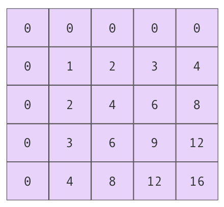
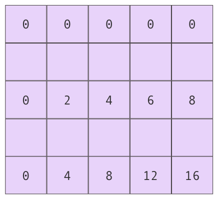

# MOB 1.1 - Lab 3 -  Collection Types & Control Flow

This Swift playground contains a series of problems to get you more familiar with Collection Types & Control Flow in Swift. The following problems are common interview questions. Answer them in a Swift Playground using what you know so far about Arrays, Dictionaries and Loops.

## Rubric

|            Not Passing       | Passing |   Stretch   |
|:----------------------------:|:-------------:|:------------:|
| Less than 90% of problems not completed | 90%+ challenges completed | 100% challenges completed |

## Problems

1. You can iterate over the key-value pairs in a dictionary with a for-in loop. Each item in the dictionary is returned as a (key, value) tuple. Print all the values from `colorHex`.

```swift
var colorHex: [String:String] = [
    "purple" : "#6C3483",
    "blue" : "#2874A6",
    "green": "#1E8449" ,
    "orange" : "#D35400",
    "yellow" : "#F1C40F",
    "white" : "#FFFFFF",
    "black" : "#000000"
]
```

2. Given an array of colors. We need to know how many times each color appears in the array.

```swift
var colors = ["red", "orange", "purple", "pink", "blue", "red", "green", "red", "blue", "purple", "pink" , "purple", "purple"]
```

Your solution should lead to this answer:

```swift
red - 3
orange - 1
purple - 4
pink - 2
blue - 2
green - 1
```

3. Write a function that returns the first N Fibonacci numbers.

Sequence: 1,1,2,3,5,8,13

```swift
func fibo(n: Int) -> [Int]

//example:

fibo(n: 7) -> [1,1,2,3,5,8,13]

fibo(n: 5) -> [1,1,2,3,5]
```

4. Write a function that prints the powers of 2 that are less than or equal to N.

5. Given:

```swift
var coursesAndStudents = [("MOB", 30), ("BEW", 40), ("FEW", 30), ("DS", 40)]
```

Write a function that prints how many students belong to each track.

Output:

```swift
There are 30 students in the MOB track
There are 40 students in the BEW track
There are 30 students in the FEW track
There are 40 students in the DS track
```

6. Write a function to check whether the first element and the last element of a given array of integers are equal. The array length must be 1 or more.

7. Write a function to compute the sum of all the elements of a given array of integers.

8. Write a function to reverse the elements of an array of integers to left direction. `[1,2,3]` becomes `[3,2,1]`

9. Write a function that accepts a String as its only parameter, and returns true if the string has
only unique letters.

10. Write a function that accepts a String and a character and returns how many times that specific character appears in the string.

11.  Given a Grid with the following numbers.



Write a function that adds up the elements in the even rows only, like this:


