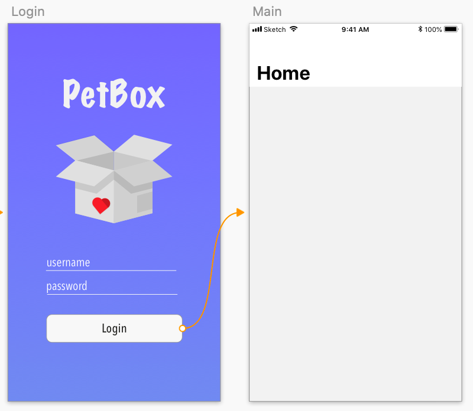

# Subscription Box - navigation & login

To proceed with this activity, you should be up to date with the Subscription Box project (up to using custom views).

<!-- > -->

## Step 1 - File Structure

Arrange your files and folders to match the MVC architecture.

<!-- > -->

## Step 2 - Getting rid of the storyboard

Delete the storyboard and modify the SceneDelegate so that the app start with the Onboarding flow.

<!-- > -->

## Step 3 - Creating new View Controllers

1. `HomeVC`: Create a new VC file that will serve as the Home of the app (where the main content is).

<!-- v -->

2. `LoginVC`: Create a new VC file that will serve as a Login screen. For now, this screen will only have a button to continue to the home screen. Add constraints to the button using the anchor approach.

<!-- v -->

3. Make the button on the last page of the onboarding flow onboarding flow direct you to the Login screen.

<!-- v -->

4. From the Login, navigate to the Home screen of the app. Make sure the Home screen is embedded in a navigation controller. (You know you did this right if you can see the navigation bar)

<!-- > -->

<!-- > -->

## After Class/Lab Time

1. Redesign your Login screen to include fields for user and password.
1. Practice sending data over by displaying the username in the Home view's title property in the nav bar.

<!-- > -->

