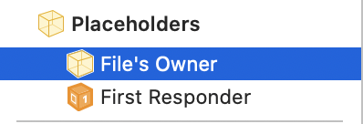
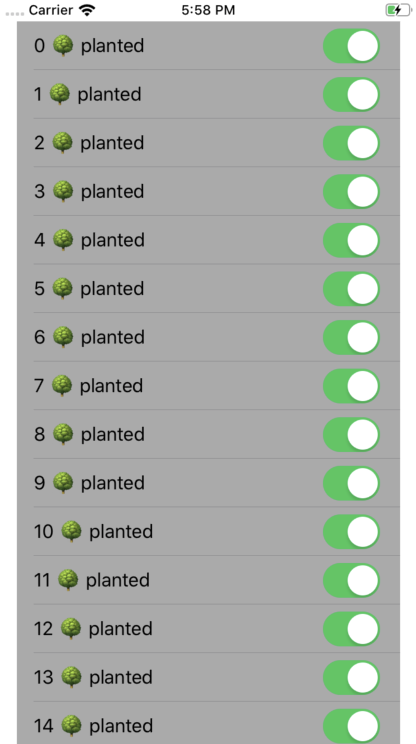

## Creating a UITableView with a Custom Cell (xib file) 🌳

## Adding the table

1. Open ViewController.swift and add a UITableView variable.
```swift
let table: UITableView = {
   let table = UITableView()
   table.translatesAutoresizingMaskIntoConstraints = false
   return table
}()
```

2. Add the constraints for the table. Pinning it to the edges of the screen.
```swift
override func viewDidLoad() {
    super.viewDidLoad()
    setTable()
}
func setTable(){
    self.view.addSubview(table)
    table.trailingAnchor.constraint(equalTo: view.layoutMarginsGuide.trailingAnchor).isActive = true
    table.leadingAnchor.constraint(equalTo: view.layoutMarginsGuide.leadingAnchor).isActive = true
    table.topAnchor.constraint(equalTo: view.layoutMarginsGuide.topAnchor).isActive = true
    table.bottomAnchor.constraint(equalTo: view.layoutMarginsGuide.bottomAnchor).isActive = true
}
```

## Creating the cell

4. Create a new file. New Cocoa Touch Class, make it a subclass of UITableViewCell. Call it "TreeCell" (you'll see why later). Check the box that says **"Also create a XIB file"**.

With this you have now created two files:
- TreeCell.swift - where you can manipulate how the cell gets created and where you'll populate it
- TreeCell.xib - where you can layout your views and take advantage of the interface builder

5. Open the xib file and let's add something to see how it would work. Add a switch control from the object library. Pin it to be vertically centered and 20 points from the trailing edge.


One more thing, and a very important one, is to **make sure our xib file is related to the .swift file**. You do this by saying that `TreeCell.swift` is the owner of `TreeCell.xib`

Locate the File's owner object in the interface builder.



Then in the attributes inspector, write the name of the class that should be the owner.


5. Now select the cell and change the identifier in the attributes inspector. Change it to "TreeCell"


6. Open `TreeCell.swift` and change the background color inside `awakeFromNib`. This method gets called after the xib file had been loaded.

```swift
self.backgroundColor = UIColor.lightGray
```

7. Let the table know that you want to use this xib file. Add the following line to your table setup. We are registering the xib file and specifying the identifier so the table knows where to find it.

```swift
table.register(UINib(nibName: "TreeCell", bundle: nil), forCellReuseIdentifier: "TreeCell")
```

## Setting the data source and delegate

8. Go back to your ViewController and add the following to your table (inside `setTable`)

```swift
table.delegate = self
table.dataSource = self
```

9. Tell your class to conform to the table's protocols. Now it looks something like this.

```swift
class ViewController: UIViewController, UITableViewDelegate, UITableViewDataSource {
...
}
```

When you are done, Xcode will tell you that you are missing some methods. Don't worry about that error, we'll include them next.

## DataSource Methods

10. Add the following array declaration as a global constant in your ViewController class, we'll use it to populate our table.

```swift
let treeArray = [String](repeating: "🌳 planted", count: 100)
```

11. Add the following methods from the data source protocol.

```swift
func tableView(_ tableView: UITableView, numberOfRowsInSection section: Int) -> Int {

}
func tableView(_ tableView: UITableView, cellForRowAt indexPath: IndexPath) -> UITableViewCell {

}
```

12. In the `numberOfRowsInSection` return the count of the `treesArray`. That's how many rows we want in the table.

```swift
return treeArray.count
```

13. In the `cellForRowAt` use the `dequeueReusableCell initializer` to have reusable cells.

```swift
let cell = tableView.dequeueReusableCell(withIdentifier: "TreeCell", for: indexPath)
cell.textLabel?.text = "\(indexPath.row) \(treeArray[indexPath.row])"
return cell
```

The first line is telling the app to use the cell with the identifier we set up before, that's how it knows what cell to reuse.

The second line is setting the text of the cell using the default label. We include the number of the row plus  the contents of the array, using the row as index.


14. Run the app. You should now have 100 rows and you should be able to scroll to the last row and find 99 trees planted. You also see the switch we added directly in the xib file and the gray color we added in code. It's not the prettiest result but you can play with how it looks later, now knowing how the .xib file and .swift file work together.


