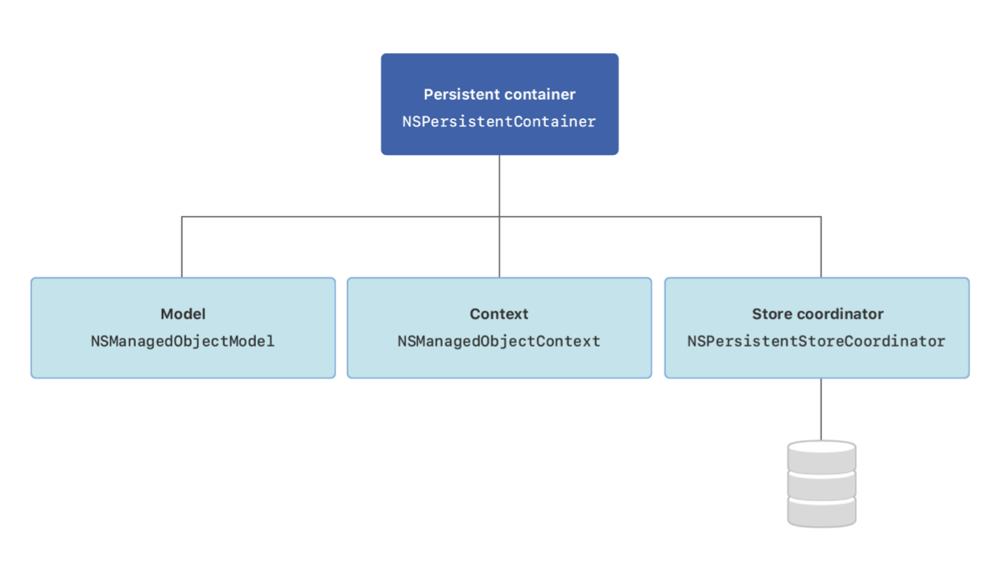
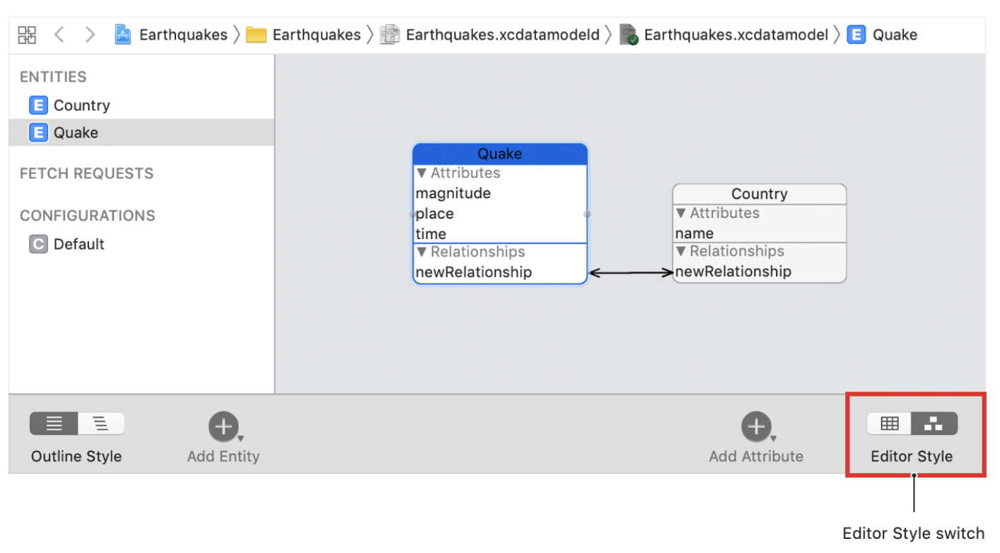
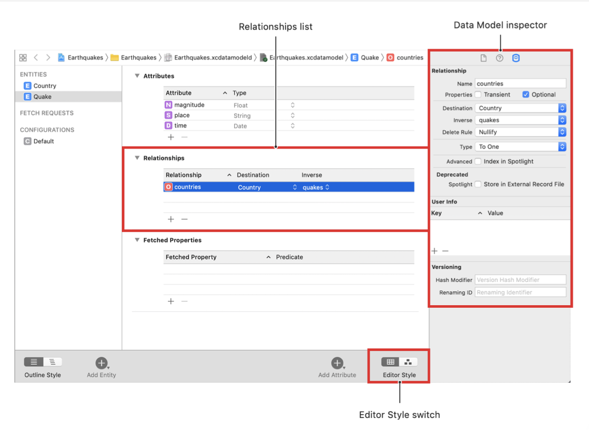
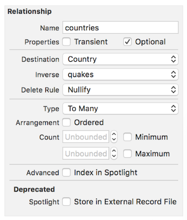

<!-- Run this slideshow via the following command: -->
<!-- reveal-md README.md -w -->

<!-- .slide: class="header" -->

# Core Data Stack & Relationships

## [Slides](https://make-school-courses.github.io/MOB-2.1-Local-Persistence-in-iOS/Slides/Lesson7/README.html ':ignore')

<!-- > -->

## Why you should know this

So far in order to use Core Data, we have been using Xcode's template that comes in the AppDelegate. We could leave it as it is and the app's functionality won't be affected. But if we really want to know the details of what's happening, we could implement **our own Core Data stack**.

This helps in two ways:
- we get to learn about how Core Data works in detail
- we get better separation of concerns (the AppDelegate shouldn't be responsible of initializing all the things).

<!-- > -->

## Learning Objectives

- Create our own Core Data Stack.
- Subclassing NSManagedObject for entities.
- Use the model editor to create relationships between properties.
- Identify different types of relationships.

<!-- > -->

## The Core Data Stack

<!-- > -->

Let's remember the components that make up the Core Data stack:

- **NSManagedObjectModel**
Represents each object type in the data model, along with its properties and relationships.

<!-- > -->

- **NSPersistentStore**
Reads and writes data to the storage we want. Core Data gives us four types of NSPersistentStore: three atomic and one non-atomic.

<!--

1. **NSQLiteStoreType** - SQLite database. (the only non-atomic store type, that comes ready to use). Lightweight & efficient = used by default.

1. **NSXMLStoretype** - XML file. The most easy to read.

1. **NSBinaryStoreType** - Binary data file.

1. **NSInMemoryStoreType** - Not persistent, only helpful for testing and maybe caching.

-->

- **NSPersistentStoreCoordinator**
Bridge between the managed object model and persistent store.

Uses the model and persistent stores to do the hard work.

Hides implementation details of the store. In this way the NSManagedObjectContext doesn't care the type of store or how many there are.

<!-- > -->

- **NSManagedObjectContext**

We ALWAYS need one of these to work with Core Data.

* This is a scratchpad for working with our managed objects.
* All the work done with objects happens here and changes won't affect data until we call save on the context.
* Manages the lifecycle of objects (relationships and validation)
* Every object keeps a reference to its context, can't exist without one.

<!-- > -->

- **NSPersistentContainer**
Container that holds everything together (the managed model, the store coordinator, persistent store and managed context)

<!-- > -->

## Relationships

A relationship describes how an entity affects another entity. At minimum, a relationship specifies:

- Name
- Destination entity
- Delete rule
- Cardinality type (To One or To Many)
- Settings for whether the relationship should be saved in the store (transient)
- Whether it is required to have a value when saved (optional).

You should also configure every relationship with an inverse relationship.

<!-- > -->

<!-- > -->

<!-- > -->

## Cardinality

Use **To One** relationships to connect the source with a single instance of the destination type.

Use **To Many** relationships to connect the source with a mutable set of the destination type.

<!-- > -->

Each relationship points from a source entity (the entity whose relationships you’re editing) to a destination entity. The destination entity is a related type that affects and is affected by the source type.

<!-- > -->

### Reflexive relationship

Setting the same source and destination types creates a reflexive relationship.

For example, an Employee may manage another Employee.

<!-- > -->

### Transient relationship

- Are not saved to the persistent store.
- Useful to store temporary values.
- Core Data tracks the changes to these values for undo purposes.

<!-- > -->

### Optional relationship

Are not required to have instances of their destination type.
In contrast, a required relationship must point to one or more instances of the destination type.

<!-- > -->

### Inverse relationship

ManagedObject relationships are inherently bidirectional.

What does that mean? 

If a User has many Tweets, then a Tweet can have one(Belong to one) User.  

Model relationships in both directions; CoreData uses that to ensure consistency of its objects.

<!-- > -->

<!-- > -->

## In Class Activity I

Instructions [here](https://github.com/Make-School-Courses/MOB-2.1-Local-Persistence-in-iOS/blob/master/Lessons/Lesson7/assignments/activity.md)

<!-- > -->

# Additional resources

- Walkthrough the creation of Entities, Attributes and Relationships can be found [here](https://developer.apple.com/library/archive/documentation/Cocoa/Conceptual/CoreData/KeyConcepts.html)
- Configuring entities [here](https://developer.apple.com/documentation/coredata/modeling_data/configuring_entities) 
- Configuring attributes [here](https://developer.apple.com/documentation/coredata/modeling_data/configuring_entities) 
- Configuring relationships [here](https://developer.apple.com/documentation/coredata/modeling_data/configuring_relationships) 
- [Modern Core Data article](https://stoeffn.de/posts/modern-core-data-in-swift/)
- Theory and activity based on content from “Core Data by Tutorials.” By Pietro Rea.
- [Relationships](https://medium.com/@aliakhtar_16369/mastering-in-coredata-part-5-relationship-between-entities-in-core-data-b8fea1b50efb)

<!--## In Class Activity I (40 min)

Clone/Download the repo below to get started:

[Shop Keep Starter](https://github.com/Product-College-Labs/shop-keep.git)

TODO:
Include the option to delete shops. 
Include functionality to add employees and managers.

Extra:
Include functionality to add shops. 
Include functionality to edit employees and managers. 
-->
