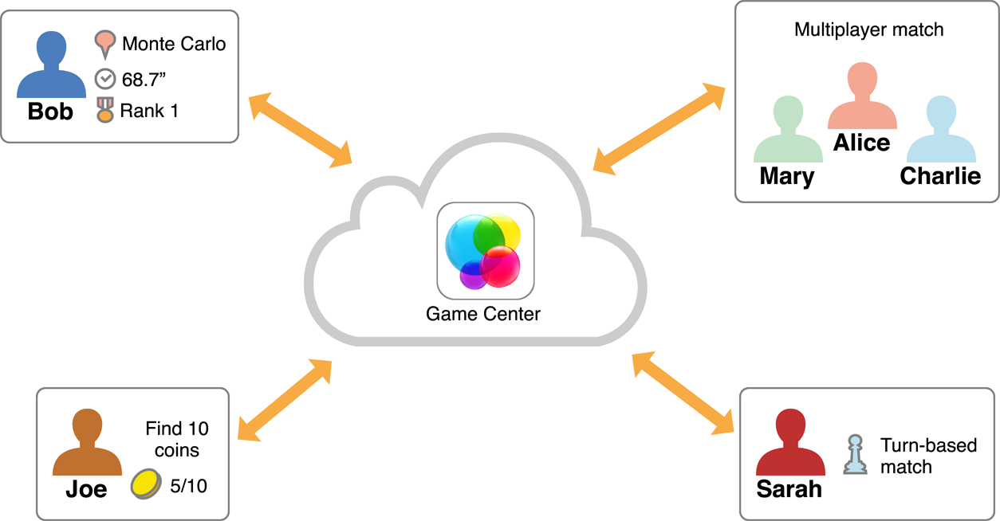
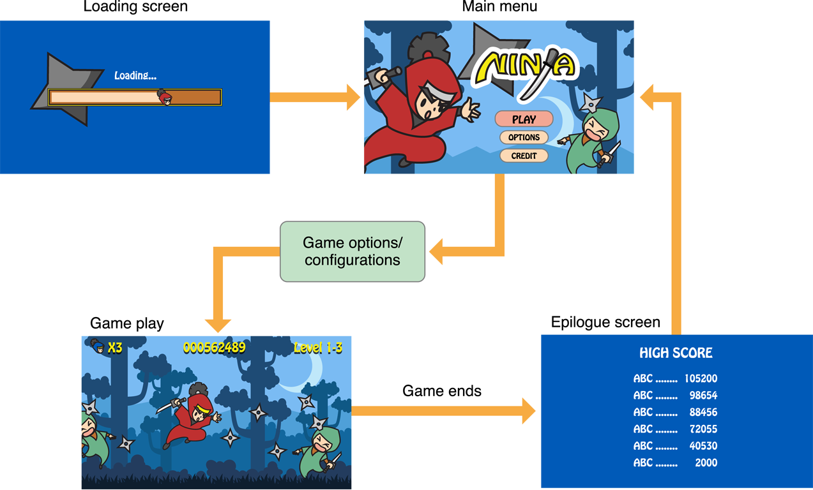
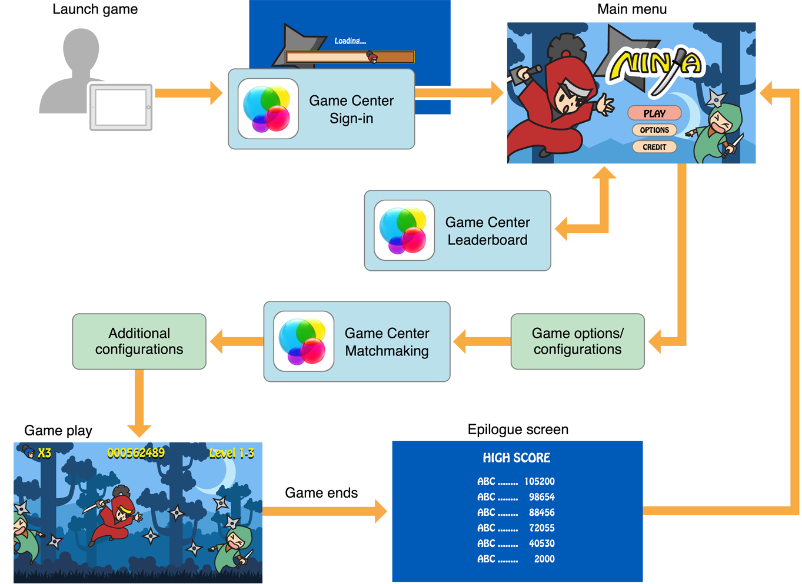

<!-- .slide: class="header" -->

# GameKit

## [Slides](https://make-school-courses.github.io/MOB-2.2-Game-Development/Slides/09-GameKit/Lesson.html ':ignore')

<!-- > -->

## Agenda

- GameKit
- GameCenter
- Resources

<!-- > -->

## Learning Objectives

- Describe how social games impact engagement.
- Identify the tools available with GameKit & GameCenter.
- Locate useful resources for implementing a social game.

<!-- > -->

## Social games

We've talked about how there are many different game genres. And each has something that makes them great for different audiences.

Games are inherently a social activity.

Sometimes, this social interaction is part of the game itself, such as when the game provides competitive or cooperative multiplayer gameplay. But even for games intended for single-player experiences, players like to see and share their accomplishments.

<!-- v -->

Social games can range from a wide variety of techniques:

- Leaderboards
- Achievements
- Matchmaking challenges

<!-- > -->

## GameKit

GameKit offers features that you can use to create great social games.

GameKit provides you with the ability to create apps that **allow players to interact with each other**.

<!-- v -->

- **Real-time network matches**: Players can invite other players to join their game. They can receive invitations to join a match even when your game is not running.
- **Turn-Based Gaming**: Store-and-forward network match infrastructure where the match is played out over a series of turns. Can be played without requiring all of the players to be connected simultaneously.
- **Game Center** 🏆

<!-- > -->

## Game Center

Centralized game service that connects players to each other.

- **Achievements**: ability to track a player’s accomplishments in the game.
- **Leaderboards**: allow the game to store and fetch player scores from Game Center.
- **Challenges**: allow a player to challenge other players to complete an achievement or to beat a leaderboard score.

<!-- v -->

<aside class="notes">
Each player performs different activities but all of them are interacting with Game Center:

Bob views his score earned in a game that supports Game Center. The Game Center app shows both Bob’s scores and scores earned by other players.

Joe is playing an adventure game that supports achievements. They just discovered an item for a quest they want to complete. The game sends a message to Game Center to update the progress stored there.

Mary, Alice, and Charlie are playing a game that supports Game Center’s matchmaking. Game Center provides a platform for the player’s devices to find and connect to each other. The game exchanges data between the participants through Game Center’s servers.

Sara plays another multiplayer game also using Game Center’s matchmaking. Sara’s game supports turn-based play and Sara has received a push notification indicating that it is their turn to act.
</aside>

<!-- > -->

## Documentation

[GameKit documentation](https://developer.apple.com/documentation/gamekit)

Can you find the related classes for:
- Challenges
- Achievements
- Leaderboards
- Turn based Games
- Real time matches
- What is the `GKGameCenterViewController`?

<!-- v -->

## How to integrate GameCenter?

[GameCenter programming guide](https://developer.apple.com/library/archive/documentation/NetworkingInternet/Conceptual/GameKit_Guide/Introduction/Introduction.html#//apple_ref/doc/uid/TP40008304)

The game needs to be Game Center aware:

- Authentication
- Game center assets

<!-- v -->

<aside class="notes">

</aside>

<!-- v -->

<aside class="notes">

</aside>

<!-- > -->

## Tutorial Resources

1. [Ray Wenderlich tutorial](https://www.raywenderlich.com/7544-game-center-for-ios-building-a-turn-based-game)
1. [Tutorial leaderboard](https://code.tutsplus.com/tutorials/game-center-and-leaderboards-for-your-ios-app--cms-27488)
