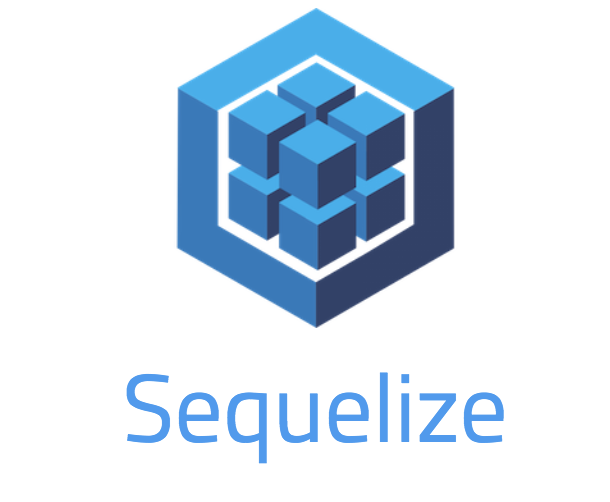

# 📄🔍 Day 1: Pagination & Search

<!-- > -->

<!-- omit in toc -->
## ⏱ Agenda {docsify-ignore}

1. [🏆 Learning Outcomes](#%F0%9F%8F%86-learning-outcomes)
1. [👋 Welcome to Class](#%F0%9F%91%8B-welcome-to-class)
1. [📁 Intro Project](#%F0%9F%93%81-intro-project)
   1. [Project Overview](#project-overview)
1. [Existing Vs New Projects](#existing-vs-new-projects)
1. [Pagination](#pagination)
   1. [Why do we need pagination?](#why-do-we-need-pagination%3F)
   1. [Question](#question)
   1. [Activity: Technical Debate - Picking a Pagination Module](#activity%3A-technical-debate---picking-a-pagination-module)
1. [Pagination Activity](#pagination-activity)
1. [[**10m**] 🌴 BREAK {docsify-ignore}](#%5B%2a%2a10m%2a%2a%5D-%F0%9F%8C%B4-break-%7Bdocsify-ignore%7D)
1. [Search](#search)
1. [Simple Search](#simple-search)
   1. [Sequelize](#sequelize)
   1. [Activity](#activity)
   1. [Mongoose](#mongoose)
   1. [RegEx](#regex)
1. [Search Activity](#search-activity)

<!-- > -->

## 🏆 Learning Outcomes

By the end of this lesson, you should be able to...

- Understand how Simple Search works, and how to implement it
- Understand how Pagination works, and how to implement it

<!-- > -->

## 👋 Welcome to Class

Instructor will walk through the [syllabus](https://make.sc/bew2.1) and answer questions about the course.

**Students**, remember to join the following:

1. Course Slack channel, `##bew-2-1-web-patterns`!
1. Gradescope: **INSERT LINK HERE**

<!-- > -->

## 📁 Intro Project

Wait a minute, a project _already?!_

**How Not To React:**


<!-- v -->

**Instead:**


<!-- v -->

### Project Overview

**TODO:**

- Add project description
- Where code will be written


<!-- > -->

## Existing Vs New Projects

You may be asking, "why are we enhancing an existing project instead of creating a new one?"


- More common as a junior engineer to be working on an existing project
- You will have to revamp/add features to an existing project at some point in your career
- Improve your existing portfolio projects to make them stand out more


<!-- > -->

## Pagination

### Why do we need pagination?

**Question:** What is the fastest way to speed up a query for 1,000,000,000 (1 Billion) records?

<!-- v -->

<details>
  <summary>
    The answer (do not click!)
  </summary>
  Use pagination to only return the first 20 records like .... Google does!
  
</details>

<!-- v -->


If you look around almost every website is paginated. Why? Probably because pagination is **one of the easiest ways to speed up page loads**. If you are loading 1000 records on your index page, that will take 10 seconds to load. Pagination will speed it up by sending only the first 20 records.

<!-- v -->

### Question

What are other benefits to pagination?

<!-- v -->

- Improved structure and readability: reduced chance of users getting lost
- Separate URLs for pages for ease of reference
- Positive effect on SEO, easier for crawlers to navigate

<!-- > -->

### Activity: Technical Debate - Picking a Pagination Module


Throughout your career, you will have many technical debates with your teams. We're going to practice that here:

1. Compare and contrast these modules, list their pros and cons, and decide which one you would use and why.

     - [paginate](https://www.npmjs.com/package/paginate)
     - [mongoose-paginate](https://www.npmjs.com/package/mongoose-paginate)
     - [express-paginate](https://www.npmjs.com/package/express-paginate)
2. Divide into groups where everyone in the group agrees on which package they would use
3. Now split your group into thirds, one third stay stays, the other two thirds go to another group and try to convince them to use your module.
4. Could you convince anyone to change? What arguments are the most compelling for people?  What arguments were most compelling to you?

<!-- > -->

## Pagination Activity

**TODO:** add small coding activity for pagination. Something like this: [https://medium.com/javascript-in-plain-english/simple-pagination-with-node-js-mongoose-and-express-4942af479ab2](https://medium.com/javascript-in-plain-english/simple-pagination-with-node-js-mongoose-and-express-4942af479ab2)

<!-- > -->

## [**10m**] 🌴 BREAK {docsify-ignore}

<!-- > -->

## Search


Think of how many websites you visit where a **Search Form** or an **Autocomplete** dropdown exists. This is a common web pattern or recipe called Simple Search.

A **Simple Search** is a search based on the text of one or a few attributes, e.g. on words in a title or body of articles or comments.

We're going to look at an implementation of Simple Search for Mongoose using Regex's. (The SQL implementation uses the SQL operator `LIKE`.)

Once we can search, we can then *paginate* the responses!

<!-- > -->

## Simple Search

### Sequelize



In order to conduct a simple search, we will use Sequelize's [query operators](https://sequelize.org/v4/manual/tutorial/querying.html#operators) `like` or `iLike` (PG only). These are basically equivalent except `iLike` is case insensitive and for Postgres databases only.

<!-- v -->

### Activity

Go back and read through the [Sequelize Querying doc](https://sequelize.org/v4/manual/tutorial/querying.html), and answer the following:

1. How would you use the `like` operator?
1. Write a query that would find all objects with a `title` of `dog`

<!-- > -->

### Mongoose


For mongoose, we can search by passing a Regex (regular expression) for the term we want to search for.

```js
User.find({ name: /john/i }, (err, docs) => { });
```

Remember to use the `RegExp` object in JavaScript to turn a string into a Regex pattern.

```js
regex = new RegExp(`/${req.query.term}/i`);
User.find({ name: regex }, (err, docs) => { });
```

<!-- v -->

### RegEx


Need a refresher? Read up on [this guide to RegEx](https://www.freecodecamp.org/news/a-quick-and-simple-guide-to-javascript-regular-expressions-48b46a68df29/), and then write RegExs for the following:

1. Return anything that has the letter "x"
1. Return anything that contains "ar"

**Stretch Challenges**

1. Return anything that starts with "the"
1. Return anything that ends with "ed"


Make sure to run it against test inputs!

<!-- > -->

## Search Activity

**TODO:** a search activity, maybe something like this tutorial: [https://kb.objectrocket.com/mongo-db/mongoose-partial-text-search-606](https://kb.objectrocket.com/mongo-db/mongoose-partial-text-search-606)
