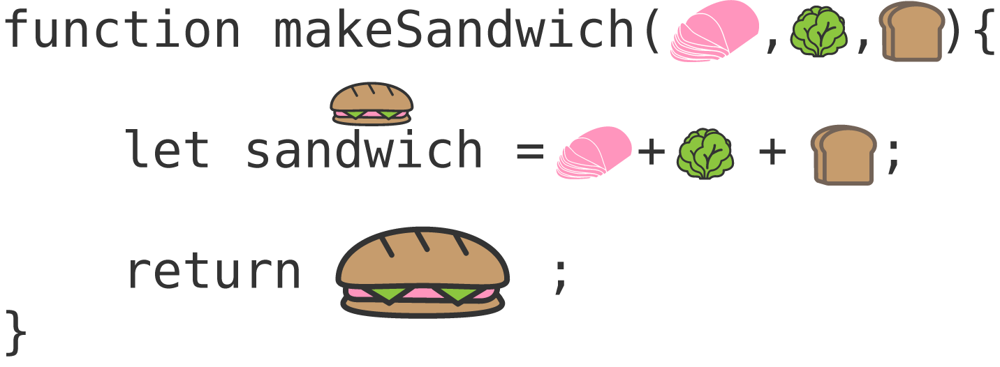
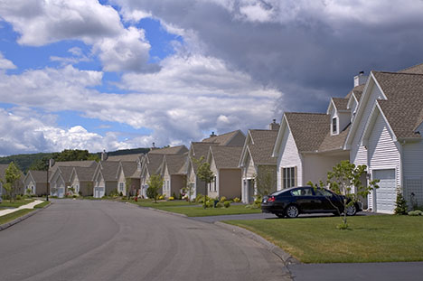

<!-- .slide: data-background="./../Images/header.svg" data-background-repeat="none" data-background-size="40% 40%" data-background-position="center 10%" class="header" -->
# Fundamentals and OOP Review Part I

[Slides](https://make-school-courses.github.io/CS-1.2-Intro-Data-Structures/Slides/Lesson1.html)

<!-- > -->

## Agenda

- Check In
- Review Functions & Scope
- Review OOP Fundamentals
    - Encapsulation
    - Classes
    - Objects
    - Methods
    - Properties
- Converting Functions to a Class

<!-- > -->

## Check In

What are you most interested in learning in this class?

<!-- > -->

## Learning Goals

- Be able to write and apply functions
- Be able to write and apply OOP concepts
- Understand how to convert a set of related functionality into a class

<!-- > -->

## Functions Review

We can think of functions like a recipe, the inputs or parameters are the ingredients and the output is the complete sandwich

<!-- > -->

## Types of Functions

We can think of dividing functions into two broad categories
- Functions that take in input, process it, and return output
- Functions that take in input, process it, and return None

<!-- > -->

## Types of Functions

Let's do a code trace this function that returns the average of a list

<iframe src="https://trinket.io/embed/python/7e04439ad9" width="100%" height="356" frameborder="0" marginwidth="0" marginheight="0" allowfullscreen></iframe>

<!-- > -->

## Types of Functions

Let's do a code trace of this function that prints something but returns None

<iframe src="https://trinket.io/embed/python/0a8a05e9c6" width="100%" height="356" frameborder="0" marginwidth="0" marginheight="0" allowfullscreen></iframe>

<!-- > -->

## Scope

All variables have a scope associated with them. Think of the scope as when a given name can refer to a given variable. Scope can be passed down the chain from global (everything) to function (within a function definition) to block (within a for or if statement)

<!-- > -->

## Scope Example

Think of a function as a small community

<iframe src="https://trinket.io/embed/python/2657c7b74d" width="100%" height="356" frameborder="0" marginwidth="0" marginheight="0" allowfullscreen></iframe>

<!-- > -->

## Functions Practice

Complete this exercise

<iframe src="https://trinket.io/embed/python/fd3574935f" width="100%" height="356" frameborder="0" marginwidth="0" marginheight="0" allowfullscreen></iframe>

<!-- > -->

## Object Oriented Programming

<!-- > -->

## Encapsulation

Bundling related data and functionality together
Providing an interface to access this information while hiding the details

<!-- > -->

## Classes

A class is like a blueprint

<!-- > -->

## Objects

An object is a thing built from the blueprint

<!-- > -->

## Methods

Methods are behaviors or functions defined within a class 

<!-- > -->

## Properties

Properties are data or variables defined within a class

<!-- > -->

## Instantiation

To create a thing (object) using the blueprint (class) we use instantiation

<!-- > -->

## An Example in Python

<iframe src="https://trinket.io/embed/python/959996e007" width="100%" height="356" frameborder="0" marginwidth="0" marginheight="0" allowfullscreen></iframe>

<!-- > -->

## OOP Practice

<iframe src="https://trinket.io/embed/python/47c67d0a94" width="100%" height="356" frameborder="0" marginwidth="0" marginheight="0" allowfullscreen></iframe>

<!-- > -->

## Shout Outs

<!-- > -->

## Learning Goals

- Be able to write and apply functions
- Be able to write and apply OOP concepts
- Understand how to convert a set of related functionality into a class

<!-- > -->

## Lab Time

