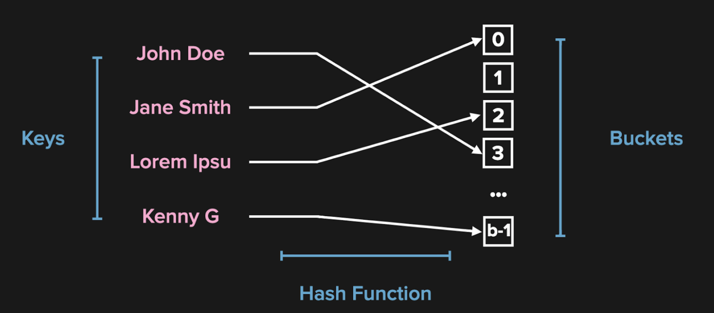
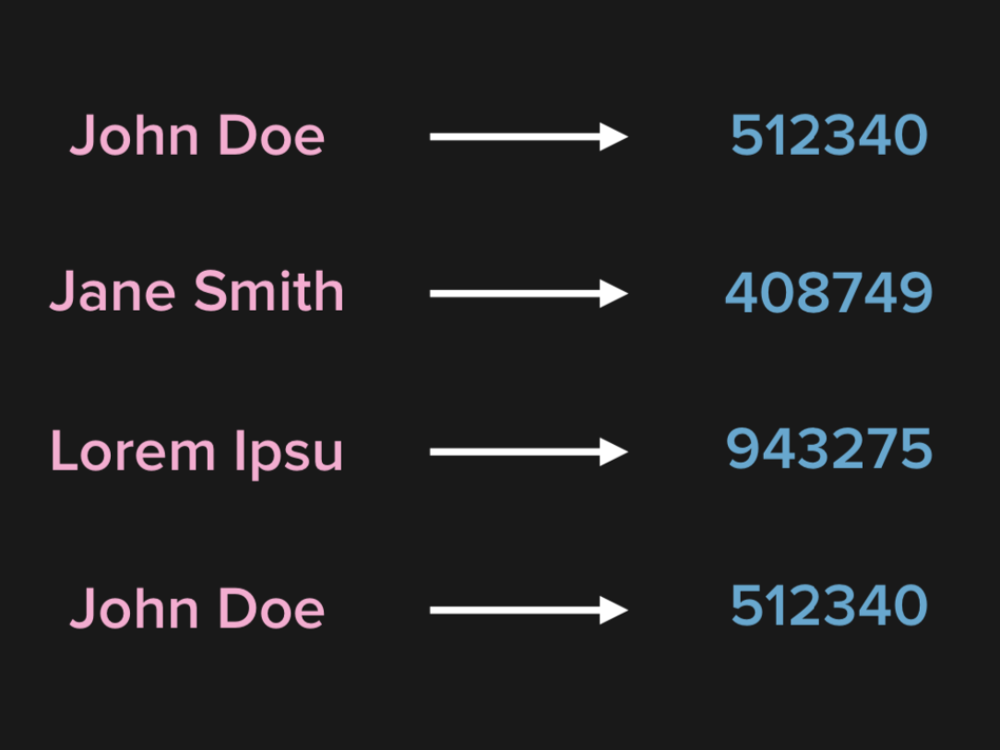
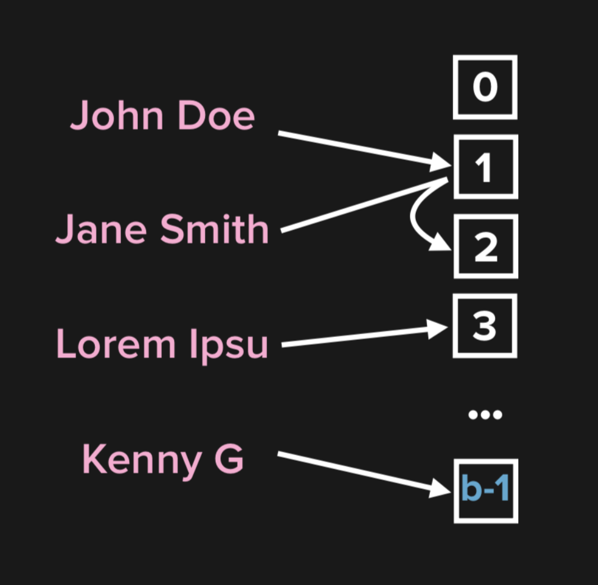
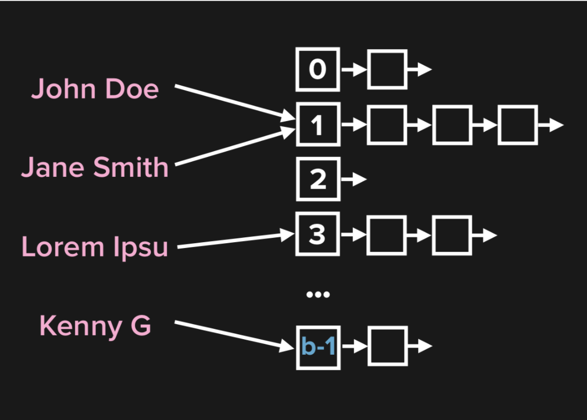

<!-- .slide: data-background="./../Images/header.svg" data-background-repeat="none" data-background-size="40% 40%" data-background-position="center 10%" class="header" -->

## Hash Tables

➡️ [**Slides**](https://make-school-courses.github.io/CS-1.2-Intro-Data-Structures/Slides/Lesson7.html ':ignore')

<!-- > -->

## Interview Question Warmup

1. Draw a linked list with 3 items: "mango", "peach", "pineapple"
2. Write pseudocode for the append method from memory 

<!-- > -->

## Hash Tables

- Maps keys → values (any objects) 
- Python’s dict() / {} type is a hash table
- Used because of strong average case performance (time complexity)

<!-- > -->

## Hash Table

<!-- > -->

## Hash Table Analogy

Think of coat checks...

<!-- > -->

## Hash Function

- Converts a variable-size input (key) to a fixed-size integer output (hash code)
- Same input → same output
- Input can be many types: number (int or float), string, or immutable collection

<!-- > -->

## Hash Function

<!-- > -->

## Which Bucket?

- Hash function outputs are very large integers, but we want the index of a bucket
- We can use the modulus operator % 

<code> index = hash(key) % buckets </code>

<code> index ranges from 0 to buckets-1 </code>

<!-- > -->

## Hash Collisions 

- It is impossible to map all possible inputs to a fixed output space without some inputs generating the same output (hash code)
- Different inputs (keys) generating the same output (hash code) is called a hash collision

<!-- > -->

## Linear Probing

- Each bucket contains at most one entry
- On collision - find next open bucket, add entry there
- To retrieve - find bucket, if that’s not entry, try next bucket until you find entry or empty bucket
- Python’s dict uses probing

<!-- > -->

## Linear Probing

<!-- > -->

## Chaining 

- Each bucket contains a linked list of entries
- On collision - add to the bucket’s linked list
- To retrieve - find bucket, find entry in linked list
- We will use chaining to implement our hash table

<!-- > -->

## Chaining

<!-- > -->

## Challenge: Draw a Hash Table Using Chaining

- Our hash table will have 4 buckets
- We have 3 key value pairs to add: "red": 5, "pink": 5, "blue": 4
- The hash function will be len(color) % num_buckets

<!-- > -->

## Shout Outs

<!-- > -->

## Lab Time

[Hash Table Worksheet](https://docs.google.com/document/d/1O8nQjC7bbKF4M5wxoelVilJo5QYC6R0a/copy)

