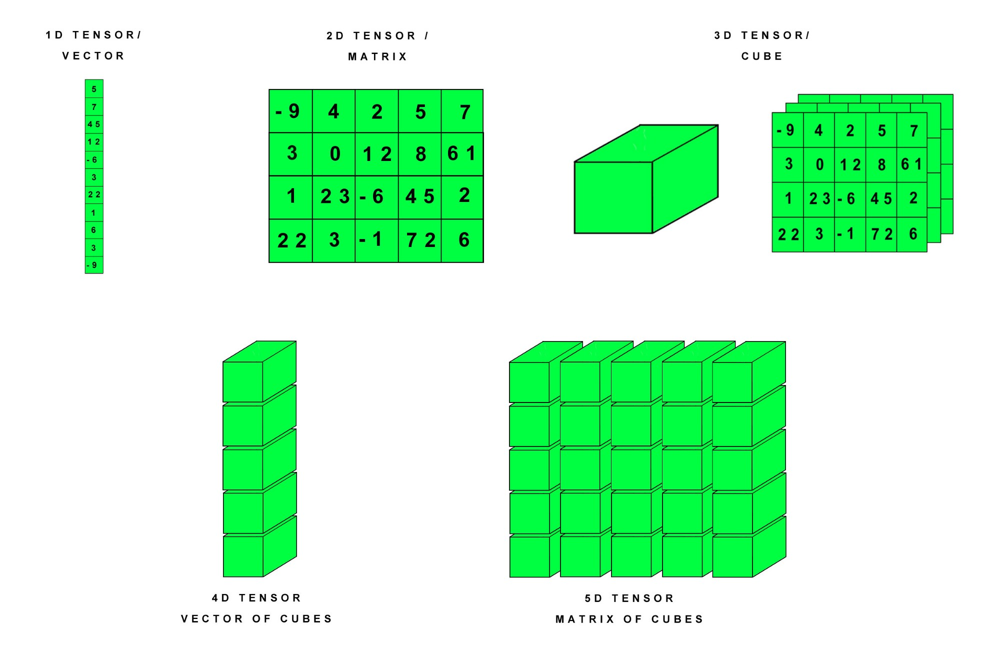

## Vector, Matrix and Tensor



## Make a vector in numpy

```python
import numpy as np

v = np.array([5,2,1])

print(v)
```

```python
print(v[1])
print(v.shape)
```

```python
v_t = np.transpose(v)
print(v_t)
v_t.shape
```
```python
v = np.array([[5,2,1]])
print(v)
print(v[1])
print(v[0][1])
```

## Make a matrix in numpy

```python
v = np.array([[1,2,3],[2, 0, 1]])

print(v)
print(v.shape)
print(v.size)
```

```python
v_t = np.transpose(v)
print(v_t)
print(v_t.shape)
print(v_t.size)
```

## Arrange or Reshape the matrix (2D array or 2D Tensor)

```python

v = np.array([[1,2,3],[2, 0, 1]])
print(v.reshape(3,2))

# By applying the following reshape, we transform the matrix into 3D Tensor

print(v.reshape(3,1,2))
print(v.reshape(-1,1,2))

```

## Make a 3D Tensor in numpy

```python
v = np.array([[[1., 2.,3.], [4.,5.,6.]], [[7.,8.,9.], [11.,12.,13.]]])

print(v)

# The first element of shape shows how many, and the second and third elements shows the dimension
print(v.shape)

print(v[0])

print(v[1])

print(v[2])

print(v.size)

print(v.reshape(3,2,-1))

print(v.reshape(3,-1,1))

```

## Make a 4D Tensor in numpy

```python
v = np.zeros((2, 3, 5, 5))

print(v)
```

## Make 5D Tensor in numpy
```python
v = np.zeros((2, 2, 3, 5, 5))
print(v)
print(v[0][0].shape)
print(v[0][1].shape)
print(v[1][0].shape)
print(v[1][1].shape)
```

## Matrix multiplication  

https://www.khanacademy.org/math/precalculus/precalc-matrices/properties-of-matrix-multiplication/a/properties-of-matrix-multiplication

```python
a = np.array([[4, 2, 3],[2, 0, 1]])

b = np.transpose(a)

c = np.dot(a,b)

print(c)
```

## Pseudo inverse of non-squared matrix

```python
pinv_a = np.linalg.pinv(a)

print(pinv_a)
print(np.dot(a, pinv_a))
print(np.dot(pinv_a, a))
```

### Share your observation

- Matrix multiplication is not commutative, AB is different from BA

## Element-wise multiplication of matrix

```python
import numpy as np
a = np.array([[1, 2],[3, 4]])
b = np.array([[5, 6],[7, 8]])
print(np.multiply(a,b))
print(np.multiply(b,a))
print(a*b)
print(b*a)
```
