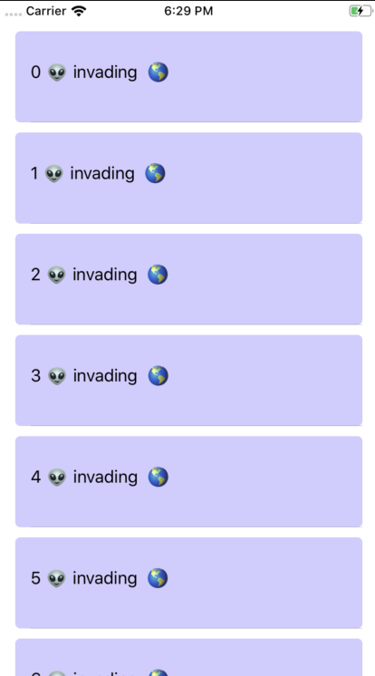

## Creating a UITableView with a Custom Cell (programmatically) 👽

## Adding the table

1. Open ViewController.swift and add a UITableView variable.
```swift
let table: UITableView = {
    let table = UITableView()
    table.translatesAutoresizingMaskIntoConstraints = false
    table.rowHeight = 100
    return table
}()
```

Note: We specify the `rowHeight` since we don't have a .xib file or other way of getting a starting height.

2. Add the constraints for the table. Pinning it to the edges of the screen.
```swift
override func viewDidLoad() {
    super.viewDidLoad()
    setTable()
}
func setTable(){
    self.view.addSubview(table)
    table.trailingAnchor.constraint(equalTo: view.layoutMarginsGuide.trailingAnchor).isActive = true
    table.leadingAnchor.constraint(equalTo: view.layoutMarginsGuide.leadingAnchor).isActive = true
    table.topAnchor.constraint(equalTo: view.layoutMarginsGuide.topAnchor).isActive = true
    table.bottomAnchor.constraint(equalTo: view.layoutMarginsGuide.bottomAnchor).isActive = true
}
```

## Creating the cell

4. Create a new file. New Cocoa Touch Class, make it a subclass of UITableViewCell. Call it "AlienCell" (you'll see why later).

You can ignore the `awakeFromNib` and `setSelected` methods for now.

Add initializers and a setup method as you would with any other custom programmatic view.

```swift
//initializer for a cell
override init(style: UITableViewCell.CellStyle, reuseIdentifier: String?) {
    super.init(style: style, reuseIdentifier: reuseIdentifier)
    self.setup()
}

required init?(coder aDecoder: NSCoder) {
    super.init(coder: aDecoder)
    self.setup()
}

func setup() {

}
```

5. Add a background to the cell so you know how it works laying out UI elements.

```swift
let background : UIView = {
  let background = UIView()
  background.backgroundColor = #colorLiteral(red: 0.8186396956, green: 0.7955000997, blue: 1, alpha: 1)
  background.layer.cornerRadius = 5
  background.layer.masksToBounds = true
  background.translatesAutoresizingMaskIntoConstraints = false
  return background
}()
```

6. Add constraints to the background in the `setup` method.

```swift
self.contentView.addSubview(background)
background.topAnchor.constraint(equalTo: self.contentView.topAnchor, constant: 10).isActive = true
background.bottomAnchor.constraint(equalTo: self.contentView.bottomAnchor).isActive = true
background.leadingAnchor.constraint(equalTo: self.contentView.leadingAnchor).isActive = true
background.trailingAnchor.constraint(equalTo: self.contentView.trailingAnchor).isActive = true
```

7. Let the table know that you want to use this custom cell file. Add the following line to your table setup. We are registering the cell and specifying an identifier so the table knows where to find it and how to reuse it.

```swift
table.register(AlienCell.self, forCellReuseIdentifier: "AlienCell")
```

## Setting the data source and delegate

8. Go back to your ViewController and add the following to your table (inside `setTable`)

```swift
table.delegate = self
table.dataSource = self
```

9. Tell your class to conform to the table's protocols. Now it looks something like this.

```swift
class ViewController: UIViewController, UITableViewDelegate, UITableViewDataSource {
...
}
```

When you are done, Xcode will tell you that you are missing some methods. Don't worry about that error, we'll include them next.

## DataSource Methods

10. Add the following array declaration as a global constant in your ViewController class, we'll use it to populate our table.

```swift
let alienArray = [String](repeating: "👽 invading  🌎", count: 100)
```

11. Add the following methods from the data source protocol.

```swift
func tableView(_ tableView: UITableView, numberOfRowsInSection section: Int) -> Int {

}
func tableView(_ tableView: UITableView, cellForRowAt indexPath: IndexPath) -> UITableViewCell {

}
```

12. In the `numberOfRowsInSection` return the count of the `alienArray`. That's how many rows we want in the table.

```swift
return alienArray.count
```

13. In the `cellForRowAt` use the `dequeueReusableCell initializer` to have reusable cells.

```swift
let cell = tableView.dequeueReusableCell(withIdentifier: "AlienCell", for: indexPath)
cell.textLabel?.text = "\(indexPath.row) \(alienArray[indexPath.row])"
return cell
```

The first line is telling the app to use the cell with the identifier we set up before, that's how it knows what cell to reuse.

The second line is setting the text of the cell using the default label. We include the number of the row plus  the contents of the array, using the row as index.


14. Run the app. You should now have 100 rows and you should be able to scroll to the last row and find 99 aliens invading Earth. You also see the background we added in code.


