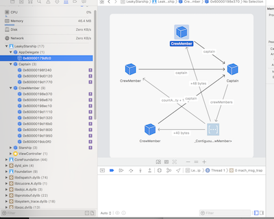
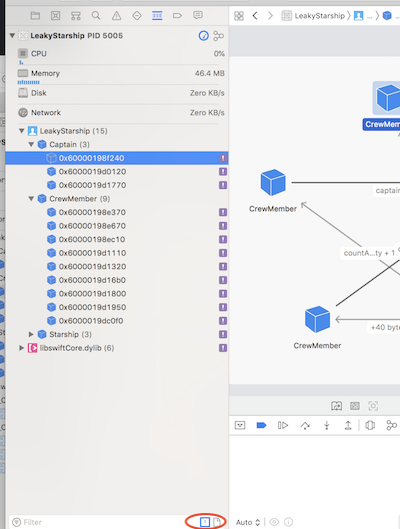

# Using the Debug Memory Graph Tool

## Learning Objectives/Competencies
At the end of this tutorial, you should be able to...

1. Identify and resolve a memory leak caused by a *strong reference* cycle (aka, retain cycle)
3. Demonstrate proficiency in using the Debug Memory Graph Tool to find and fix a memory leak caused by a retain cycle

## Steps to Find and Resolve Memory Leaks

### Identify A Memory Leaky

**Requirement:** [LeakyStarship App](https://github.com/VanderDev1/LeakyStarship)


1. Run the LeakyStarship starter app and click the button two or three times…

2. In the Debug area, click the Debug Memory Graph button on the Debug Toolbar:


Let’s observe what occurs in Xcode:
- on click of the Debug Memory Graph button, Xcode sets a temporary (system) breakpoint in your app at the point where you clicked the button
- the Navigator panel switches to the Debug Navigator and displays a graph of the current objects in memory




***Note:*** *all the purple squares with exclamation points indicate memory leaks.*


3. Now, let’s focus the Debug Navigator on only those objects in memory causing memory leaks:
at the bottom right of the Navigator pane, click the little rectangular “Show only leaked blocks” icon



- Examine the leaks found under the Captain, CrewMember and Starship objects.
- Also, briefly notice the memory leaks under the two `ContiguousArrayStorage` objects.

### Finding the Source of the Leak

Let’s examine the source of one of the memory leaks caused by strong reference cycles.

For now, let’s focus only on the leaks in CrewMember objects.

4. In the Debug Navigator panel, select the CrewMember object you want to examine. If open, close the Assistant Editor and minimize the Debug area to maximize your view of your CrewMember object’s memory graph in Xcode’s middle panel.


- Notice that each of the CrewMember objects holds a strong reference to the Captain object — while the Captain object holds a strong reference to each of the CrewMember objects.

- Notice, too, that the Captain object (cube) holds a strong reference to its CrewMember objects through the array object, `_ContiguousArrayStorage<CrewMember>` (by default, arrays in Swift hold strong references to their elements).

### Fixing The Leak

5. Ctrl+Click (or Right+Click) one of the CrewMember object cubes in the memory graph.

6. The context menu displayed offers several useful choices. Choose the `Jump to Definition` option in the dropdown list.

Xcode should open your CrewMember class file:

```Swift
class CrewMember
{
    let name:String
    var captain:Captain

    init(name: String, captain: Captain)
    {
        self.name = name
        self.captain = captain

        print("CrewMember \(name) instance allocated.\n")
    }

    deinit
    {
        print("CrewMember \(name) instance deallocated.\n")
    }
}
```

**Q:** Based on what you’ve learned so far about strong reference cycles, how would you go about fixing the memory leak currently existing for the CrewMember objects?

**TODO:**
- Apply your solution.
- Run the app again and bring up the Memory Graph Debug tool.
- You should be able to explain the effect of your solution on all reference type instances which were causing memory leaks in the original state of the app.

## When you are done:

- Take a screenshot of the Memory Graph Debug tool without the memory leaks. Send it to the instructor over Slack.

## FEEDBACK AND REVIEW

Please take a moment to rate your understanding of learning outcomes from this tutorial, and how we can improve it via our [tutorial feedback form](https://goo.gl/forms/XC9KpW6fvzEPvWS92)
