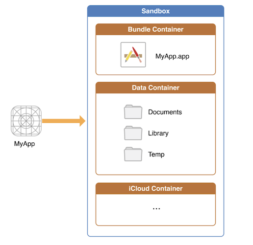

<!-- Run this slideshow via the following command: -->
<!-- reveal-md README.md -w -->


<!-- .slide: class="header" -->

# The File System 🗃

## [Slides](https://make-school-courses.github.io/MOB-2.1-Local-Persistence-in-iOS/Slides/Lesson4/README.html ':ignore')

<!-- > -->

Knowing about how the file system works in an iOS app will enable us to correctly manage how we **store and access** data.

There's a lot of things to consider when using the file system, and as iOS developers it is in our best interest to responsibly handle these resources.

This includes not abusing how much we save into files, using the correct file hierarchy and storing data only in files we are allowed to.

<!-- > -->

## Learning Objectives

- Identify the components of the File System in an iOS app.
- Access, store & edit data from the File System.

<!-- > -->

## File System

Handles the persistent storage of data files, apps, and the files associated with the operating system itself.

- Uses directories to create a hierarchical organization.
- Only **some** directories are available to store and manage files.

<!-- > -->

- User's files remain easily discoverable and files our code uses internally are kept out of the user's way.
- Users of iOS devices do not have direct access to the file system and apps are expected to follow this convention.
- Apps can only read/write files within their **sandbox**.

Every app has a designated space to handle files, this is known as Sandbox.

<!-- > -->

When installing a new app, the installer creates **container directories** for the app inside the sandbox directory. Each container directory has a specific role.

- The **bundle container** directory holds the app's bundle.  
- The **data container** directory holds data for both the app and the user. This can further be divided into a number of subdirectories that the app can use to sort and organize its data.
- The app may also request access to additional container directories—for example, the iCloud container—at runtime.

<!-- > -->



<!-- > -->

**Main App Bundle**

```swift
<Application_Home>/AppName.app
```

- This is the main bundle of the App.
- All of the content here is created at compile time (based on files added in Xcode) and cannot be modified at runtime!
- Contains binary along with resource files
- You cannot write to this directory.

<!-- > -->

**Documents Directory**

```swift
<Application_Home>/Documents/
```

- Place to store data that is critical to your application
(user generated content, content that cannot be automatically
regenerated)
- Backed up with iTunes Backups and it can be
made available to iTunes.
- **This is what we use the most** 😀👍🏼

<!-- > -->

**Temporary Directory**

```swift
<Application_Home>/tmp
```

- Use this to store files that you do not need to persist
permanently.
- You are responsible for removing files from this
directory when they are no longer needed.
- The system may purge this directory when your app is not running. 😰

<!-- > -->

**Library Directory**

```swift
<Application_Home>/Library
```

- Used to store files that you don't want to expose to the user

<!-- > -->

**Library Cache**

```swift
<Application_Home>/Library/Caches
```

- To store cached information (e.g. pictures that have been downloaded).
- iOS will remove files from this directory when it needs to free
disk space.

<!-- > -->

| App Bundle | Documents Dir  | Temporary Dir | Library Dir | Library Cache |
| -------- | --------- | ------ | ------ | ------ |

Where would you store:

<p class="fragment fade-up">Drawing created by a user in a graphics app</p>
<p class="fragment fade-up">Temporary token</p>
<p class="fragment fade-up">Text files from a notes app</p>
<p class="fragment fade-up">Configuration files</p>
<p class="fragment fade-up">Data files</p>
<p class="fragment fade-up">Downloaded images (ex. profile pictures)</p>
<p class="fragment fade-up">Videos and audio files</p>


<!-- > -->

**FileManger demo**

- Identifying the DocumentsDirectory url
- Writing to a file
- Reading from a file
- Creating directories

<!-- v -->

## Writing files

Writing a file to the documents directory:

```swift
let fileManager = FileManager.default
let urls = fileManager.urls(for: .documentDirectory,
                                    in: .userDomainMask)

if let documentDirectory: URL = urls.first {
    let documentURL = documentDirectory.appendingPathComponent("txtFile.txt")
    // data you want to write to file
    let data: Data? = "Hello World".data(using: .utf8)
    do{
      try data!.write(to: documentURL, options: .atomic)
    }catch{
        // some error    
    }
}
```

<!-- v -->

## Accessing files within the documents directory:

```swift
let fileManager = FileManager.default
let urls = fileManager.urls(for: .documentDirectory, in: .userDomainMask)
if let documentDirectory: URL = urls.first {
    let documentURL = documentDirectory.appendingPathComponent("txtFile.txt")
    do {
        print(documentURL)
        let content = try String(contentsOf: documentURL, encoding: .utf8)
        print(content)

    } catch let error {
        print(error.localizedDescription)
    }
}
 ```

<!-- v -->

## Creating directories

```swift
do{
  try manager.createDirectory(atPath: (urls.first?.appendingPathComponent("notes").path)!, withIntermediateDirectories: true, attributes: nil)
}catch{
  print(error)
}
```

<!-- v -->

Visit the documentation page for info on how to access specific directories in the filesystem

[FileManager Documentation](https://developer.apple.com/documentation/foundation/filemanager)

<!-- > -->

## When to use filesystem

- Primarily when storing/caching binary data such as images/ audio/ video
- Can also be used to store **serialized Objects**

<!-- > -->

## In Class Activity

In this activity you will use the file system to add persistence support to an app that reviews meals. 🍜

Use [this project](https://github.com/amelinagzz/FoodRating-starter/tree/main) that has all the functionality you need except for persistence. If you delete the app, all the content will be gone. Your job is to fix this.


<!-- > -->

## Resources

[FileManger Documentation](https://developer.apple.com/documentation/foundation/filemanager)<br>
[Apple's File system basics](https://developer.apple.com/library/archive/documentation/FileManagement/Conceptual/FileSystemProgrammingGuide/FileSystemOverview/FileSystemOverview.html)<br>
[String to data and back](https://www.objc.io/blog/2018/02/13/string-to-data-and-back/)
