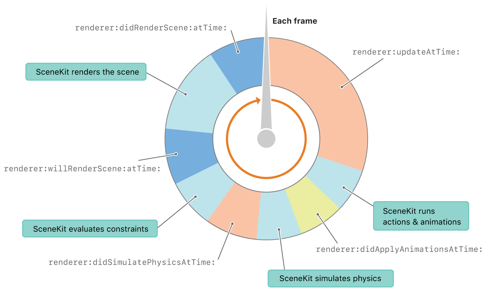
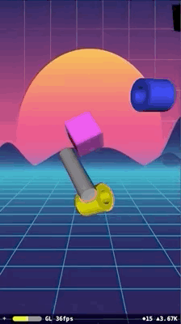

## Bouncing Shapes - Part 2

First, let's adjust the camera so that the shape doesn't appear randomly in the middle of the screen.

```swift
cameraNode.position = SCNVector3(x: 0, y: 5, z: 10)
```

Now add the following to the part in your code where shapes are created:

```swift
geometry.materials.first?.diffuse.contents = UIColor.purple
```

Build and run. See how simple it is to give the shape a solid color as material.

What you need to do is figure out a way to give the shape a different color every time it is created.

### The Rendering Loop

SceneKit renders the contents scenes using `SCNView` objects. `SCNView` has a delegate property that we can set to an object that conforms to the `SCNSceneRendererDelegate` protocol. `SCNView` will then call methods on that delegate when certain events occur on each frame.



We wan to add multiple shapes in the scene. Try adding this extension to the game:

```swift
extension GameViewController: SCNSceneRendererDelegate {
    func renderer(_ renderer: SCNSceneRenderer, updateAtTime time: TimeInterval) {
        spawnShape()
    }
}
```

Don't forget to set the delegate to self on the SceneKit's view.

Build and run. 😱

- What happens?  
- Is this good for performance?
- How can you tell?

Let's try to spawn a few shapes every few seconds to make this better.

```swift
var spawnTime: TimeInterval = 0
...
if time > spawnTime { //Where do you think this goes?
  spawnShape()
  spawnTime = time + TimeInterval(Float.random(in:0.2...1.5)) //What is this doing?
}
```

<!-- We check if time (the current system time) is greater than spawnTime. If so, spawn a new shape; otherwise, do nothing. After we spawn an object, update spawnTime with the next time to spawn a new object. The next spawn time is simply the current time incremented by a random amount. Since TimeInterval is in seconds, you spawn the next object between 0.2 seconds and 1.5 seconds after the current time. -->

Build and run again. Isn't it much better now? 😀

The last thing we need to do is make sure we are removing object from the screen. Just like in SpriteKit, there is a method to remove nodes from the scene. `removeFromParentNode()`. Find a way to remove objects once they are no longer on sight.

In the end your scene should look something like this:


