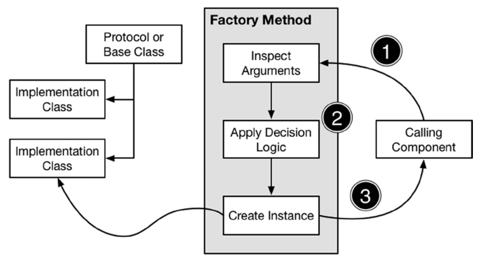
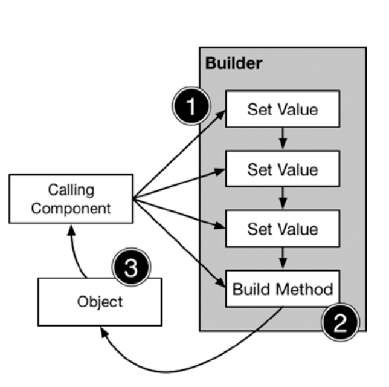

<!-- Run this slideshow via the following command: -->
<!-- reveal-md README.md -w -->

<!-- .slide: class="header" -->

# Creational Patterns Pt.2

## [Slides](https://make-school-courses.github.io/MOB-2.4-Advanced-Architectural-Patterns-in-iOS/Slides/02-Creational-PatternsPt.2/README.html ':ignore')

<!-- > -->

## Learning Objectives

1. Describe
- the **Factory Method** and **Builder** patterns
- the software problem each is intended to solve
- potential use cases for each (when to use them)

2. Assess:
- the suitability of a given design pattern to solve a given problem
- the trade offs (pros/cons) inherent in each

3. Implement basic examples of both patterns explored in this class

<!-- > -->

### The Factory Method Pattern

#### Problems Addressed

- How do you create objects without needing to specify the exact class of the object to be created?
- How can a class defer instantiation to subclasses?

By using the Factory Method pattern!

<!-- > -->

#### Description

Factory Method is a Creational Pattern used to create objects without needing to specify the exact class of the object.

Instead of using a constructor, it creates objects by calling a **specialized method** accessible to calling components.

<!-- > -->

The Factory Method pattern is executed in **three operations:**

<!-- v -->

1. A function in some calling component calls the factory method supplying it with the arguments required to select the  implementation class desired.

<!-- v -->

2. The factory method executes using the passed-in arguments to create an instance of the desired class.

<!-- v -->

3. Once the instance of the desired class is created, the factory method returns to the calling component a reference to the newly-created object of the desired class.

<!-- > -->

#### Implementation

Factory Method implementation is:

- either specified in an interface or **protocol** and implemented by child classes
- or implemented in a **base class** and optionally overridden by derived classes

Once implemented, the Factory Method will have all logic required to select a specifically desired class to instantiate, but it only exposes the protocol or base class to the calling component.

<!-- > -->

## In Class Activity I

[Link to activity](https://github.com/Make-School-Courses/MOB-2.4-Advanced-Architectural-Patterns-in-iOS/blob/master/Lessons/02-Creational-PatternsPt.2/assignments/factory.md)

<!-- > -->

## Think, Pair, Share

1. What are the benefits of the factory pattern?
2. When would you use it?

After you pair, We'll go over the benefits and use cases as a class

<!--
#### Benefits
1. Factory Method pattern makes the codebase more flexible to add or remove new types.
2. It is simple to implement.
3. It is often combined with the Singleton and Object Pool patterns.

#### When to use

The goal of this pattern is to encapsulate a **thing** for which optional variations of that thing are needed.

Use it when there is a choice to be made between classes that implement a shared protocol or base class.

This pattern works when a calling component can rely on the existence of only one single base type
- __*do not*__ use it if there is no single common base class or shared protocol.

-->

<!-- > -->

### The Builder Pattern

<!-- v -->

<!-- v -->

<!-- > -->

#### Description

The Builder pattern is a creational design pattern that allows you to create complex objects — composed of requisite parts — from simple objects.

It differs from other Creational patterns in that it:

- employs a step-by-step approach
- calls for separating the construction of an object from its own class (i.e., An external class controls the construction algorithm).

<!-- > -->

#### Implementation

<!-- > -->

**Step-by-Step Approach**

The pattern organizes object construction into a set of **steps** which must be created in the same order, or by using a specific algorithm, to repeatedly create multiple objects of the same type.

<!-- > -->

To create an object, you execute a series steps on a __*builder*__ object.

The construction of the intended object is assigned to builder classes/objects and split into multiple steps — but you are not required to call all steps for *all* objects created.

You are allowed to call only those steps required to produced a particular object configuration.

<!-- > -->

<!--
**External Builders**

The Builder pattern suggests that you extract the object construction code out of its own class and move it to separate objects called *builders.*

The construction of the intended object is assigned to builder classes/objects and split into multiple steps.

To create an object, you successively call builder methods on an instance of a builder class, which builds the final object step-by-step and returns it as its final step.
-->

<!-- > -->

**Typical Steps**

1. In a **base builder class or protocol**, declare the construction steps common to all intended optional object representations.

2. Declare a **concrete builder class** for each of the object representations. Implement their specific construction steps, including implementing a function to fetch/return the constructed object, if applicable.

3. Consider creating an additional class — often referred to as a **Director** — to encapsulate various ways to construct an object using the same builder class.

<!-- > -->

4. Implement client code to create both the builder and director objects.
    - The client should pass the builder object to the director, and the director will use this builder object in all additional construction.

5. Returning the constructed result can be achieved in optional ways. For example:
    - It can be obtained directly from the director,  if all optional intended objects follow the same steps.
    - The client can fetch the result from the builder.

<!-- > -->

#### Examples

- [Link to widget example](assignments/widget.md)
- [Link to burger example](assignments/burgerExample.md)

<!-- > -->

## Think, Pair, Share

1. What are the benefits of the factory method?
2. When would you use it?

After you pair, We'll go over the benefits and use cases as a class

<!--
#### Benefits
This pattern allows you to produce different types and representations of an object using the same construction code.

Builder can use one of the other patterns — including Singleton or Bridge — to provide the logic that decides which object gets built.

Builder is one of the top design patterns used in iOS development (along with Singleton and Factory Method)

#### When to use (problems addressed)

Use the Builder pattern when…
- you need to compose complex objects
- you want to avoid having a constructor with too many parameters (difficult to work with)
- your code needs different versions of a specific object

**iOS Example**
What if you want to create a view controller which creates a custom view based on the user’s selection of key criteria such as:

- Region
- Gender
- Age
- Personal Interests
- etc.

...and then present a *different* view based on each of the choices the user selects?

Builder facilitates this architecture nicely!

-->

<!-- > -->

## In Class Activity

[Link to activity](https://github.com/Make-School-Courses/MOB-2.4-Advanced-Architectural-Patterns-in-iOS/blob/master/Lessons/02-Creational-PatternsPt.2/assignments/builder.md)

<!-- > -->

## After Class / Lab

Complete the sections in the [worksheet](https://docs.google.com/document/d/11jRhbMQfxqDy3SP-Xs_EnWUnuwcwX3QFvNYnRbVvwWo/edit?usp=sharing) for the patterns covered in class.

Also known as __*A Virtual Constructor,*__ the Factory Method pattern is closely related to the *Abstract Factory pattern* and can also be considered a specialization of the *Template Method pattern.*

Research these patterns with an eye toward examining how they relate to either the Builder or Factory Method patterns:
    - Virtual Constructor
    - Abstract Factory Pattern
    - Template Method Pattern
    - Object Pool Pattern
    - Bridge Pattern

<!-- > -->

*(Stretch Challenge/Article idea)* Using the Builder pattern, create a simple Single View App with the constructs necessary to build a pizza -  including 4 toppings - when the user presses a button

<!-- > -->

## Additional Resources

- [Factory Method Pattern - wikipedia](https://en.wikipedia.org/wiki/Factory_method_pattern)
- [Article 1](https://en.wikipedia.org/wiki/Builder_pattern) 
- [Article 2](https://www.geeksforgeeks.org/builder-design-pattern/) 
- [The swift dev- builder pattern](https://theswiftdev.com/swift-builder-design-pattern/)
- [Refactoring Guru - Builder Pattern](https://refactoring.guru/design-patterns/builder)
- [Refactoring Guru - Factory Pattern](https://refactoring.guru/design-patterns/factory-method)
- Book: Pro Design Patterns in Swift
- [Gang Of Four Cheat Sheet](http://www.blackwasp.co.uk/GangOfFour.aspx)
